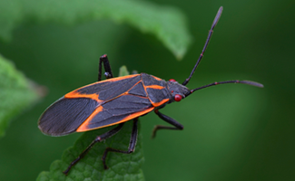
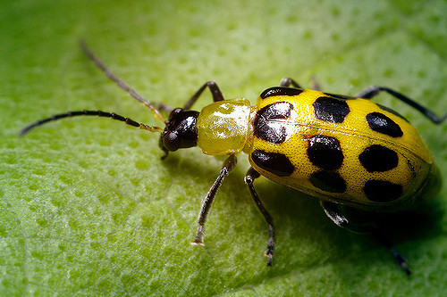
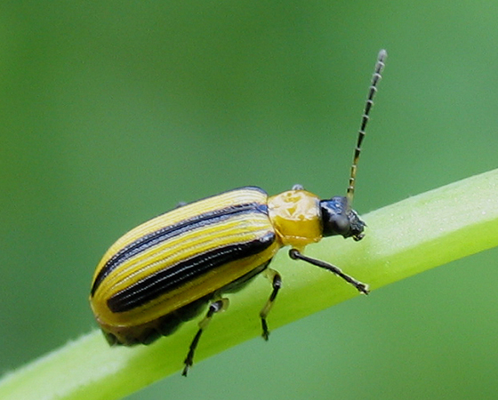
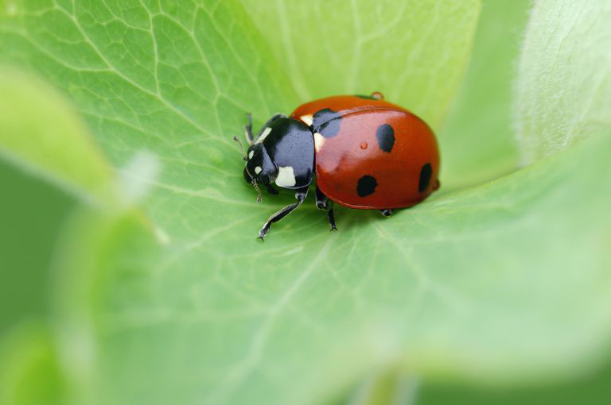
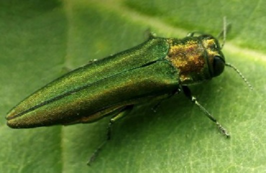
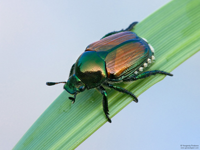
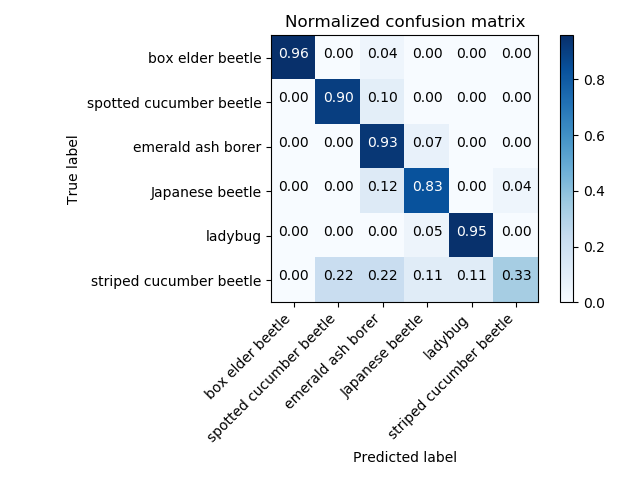
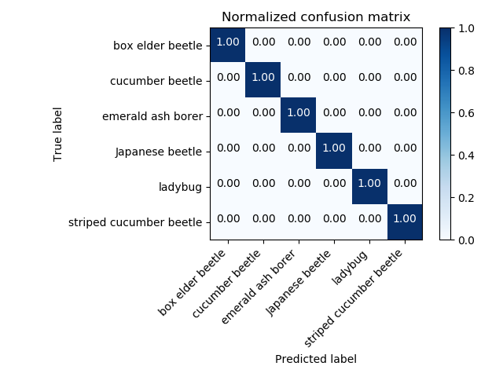
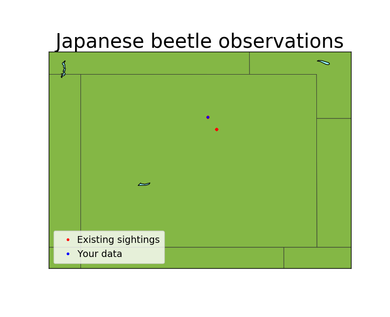

# Neural Bug Net - Part 2

### Motivation

The goal of this project was to create a web app to track Japanese Beetle activity in Colorado. Identification would be done using a convolutional neural net (CNN) and location data would be pulled from the images uploaded by users. Japanese beetles are an invasive species and an agricultural pest and so there is interest in tracking their spread. Additional background information can be found in [Part 1](https://github.com/Milliemonster/Neural_Bug_Net_Part1) of this project.

### Data
Six types of beetles were selected for training the model. Selection criteria were that the beetles were present in Colorado with particular emphasis on agricultural pests (all but the ladybug could be considered an agricultural pest). Because my simple CNN used in Part 1 of this project seemed to be making mistakes based on color, I made sure that some types of beetles were similar in color so that I could be sure I was improving my model. The spotted and striped cucumber beetles are very similar other than the shape of their markings. Images were downloaded from google images and Flickr.

Data cleaning was done using the script developed in part 1 of this project. Similarly to Part 1, I removed any instances were there were two different types of beetle present in the photo. In contrast to the images used to train the model in Part 1, I kept images that were other than a close up or included clusters of multiple beetles.

The resulting images represent a class imbalanced dataset with the largest number of images being 251 and the smallest being 100. This was addressed during modeling. The Keras ImageDataGenerator function was used to generate additional data by applying the transformations shift, shear, and horizontal and vertical flip to the original dataset.

##### Box elder beetle: 251 images

##### Spotted cucumber beetle: 215 images

##### Striped cucumber beetle: 100 images

##### Ladybug: 223 images

##### Emerald ash borer: 145 images

##### Japanese beetle: 245 images

### Model
In Part 1 of this project, a simple CNN was created and trained on three classes of beetles (Japanese, spotted cucumber, and ladybug). This model had only 5 convolutional layers and image size was limited to (100, 100, 3) because it was being trained on a local machine. This model seemed to make mistakes that were color based such as predicting that a Japanese beetle sitting on top of a raspberry was a ladybug.

For Part 2 of this project, the models were trained on an AWS EC2 deep learning AMI. The additional computing power made it possible to employ a transfer learning model. The Xception model was chosen which was pre-trained on 1.2 million images in 1000 categories from the Imagenet dataset. Xception contains 36 convolutional layers organized into 14 modules. The model was trained on the new data in three steps, first unfreezing and training the head and then the last and next to last modules in turn.

For comparison, the simple CNN was re-fit on the expanded dataset and the results were compared to the transfer learning model. Models were fit with categorical cross-entropy as a loss function. The final models were evaluated using the average recall for each class (balanced accuracy score). Both models used weighted classes during fitting to account for class imbalance.

### Results and discussion
**Simple CNN (Part 1 model):** Balanced accuracy score on holdout data: 81%  
In spite of weighting the classes, this model had trouble identifying the class with the fewest examples.

**Transfer learningwith Xception:**
Balanced accuracy score on holdout data: 100%  
Because there were only 113 holdout images, it seems likely that there was some degree of chance involved that the model was able to correctly predict every image in the set. Performance could probably be expected to differ somewhat given more images. For comparison, the balanced accuracy score of the validation set was 98%.

### App
Visit [neuralbug.net](www.neuralbug.net) to try it out!  
Once a predictive model was established, an app was created using Flask and deployed with Docker. Images could be uploaded by users and species and location data are collected. The app displays the model's identification of the beetle and a distribution map.

### Mapping
When a user uploaded an image that was identified as a Japanese beetle, the Python Imaging Library was used to extract EXIF data from images, which contains GPS coordinates. Locational data were added to a Pandas dataframe and stored as a pickle in an AWS S3 bucket. Matplotlib Basemap was used to map the new data along with data submitted by previous users.

### Future Directions
This project was completed over the course of five days as the final capstone for the [Galvanize Data Science Immersive](https://www.galvanize.com/data-science#curriculum). Because of the limited timeframe, there are aspects of the project that I wish could have been built out more.  
- Inclusion of additional classes as well as null classes
- Submitting actual user data for analysis (project was completed in December when beetles are generally not available in Colorado)
- Live mapping on the website. Although live mapping worked on my local machine, there was difficulty including the basemap library in the docker image and so the map displayed on the site doesn't display the newly submitted data. GPS data is simply being collected and stored in a database at this time.  
